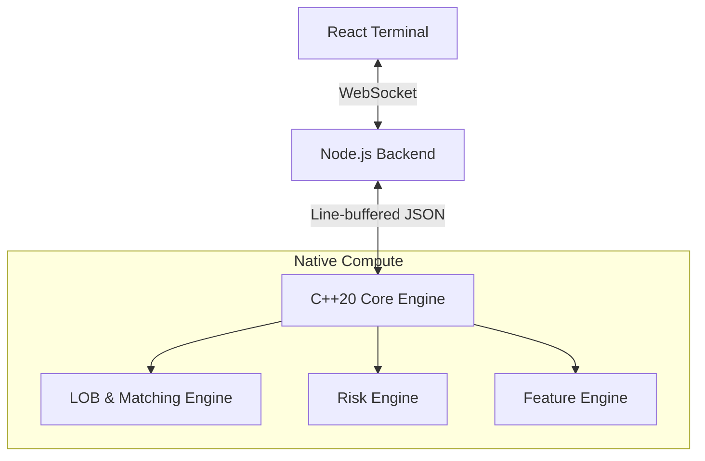
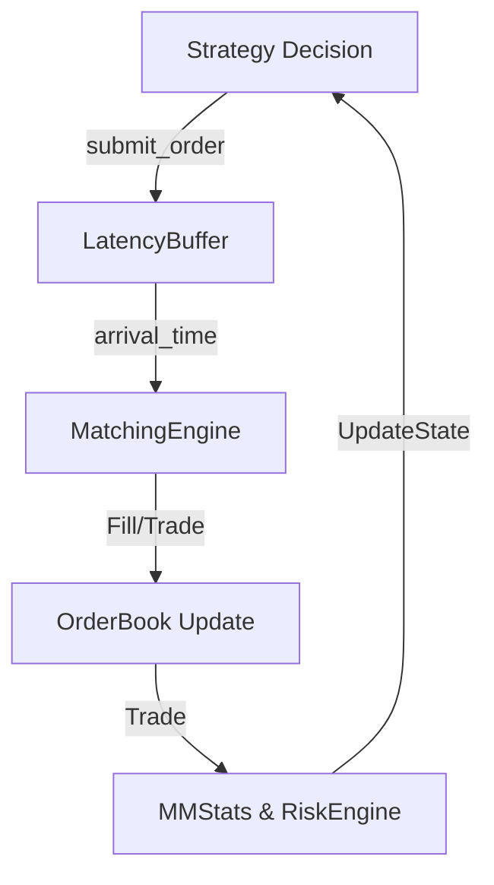

# Trade-Engine: Adaptive Market-Making Research Terminal

[](https://en.cppreference.com/w/cpp/20)
[](https://nodejs.org/)
[](https://react.dev/)
[](https://www.typescriptlang.org/)
[](https://vitejs.dev/)
[](LICENSE)

Trade-Engine is an experimental research and simulation laboratory for exploring and stress-testing market-making strategies within a simulated limit order book (L2) environment. It serves as a technical portfolio project to demonstrate high-performance systems engineering, quantitative simulation modeling, and full-stack application development.

It is **not** designed for live exchange trading. It is an educational and research tool for quantitative developers to study microstructure dynamics in a controlled, deterministic environment.

---

## Table of Contents
1. [Project Overview](#1-project-overview)
2. [Demo & Screenshots](#2-demo--screenshots)
3. [System Architecture](#3-system-architecture)
4. [Data Flow & Order Lifecycle](#4-data-flow--order-lifecycle)
5. [Technology Stack & Architectural Rationale](#5-technology-stack--architectural-rationale)
6. [Strategies & Simulation Model](#6-strategies--simulation-model)
7. [Risk Management & Financial Metrics](#7-risk-management--financial-metrics)
8. [Engineering Challenges & Solutions](#8-engineering-challenges--solutions)
9. [Testing, Benchmarks & Experimental Results](#9-testing-benchmarks--experimental-results)
10. [Installation & Usage](#10-installation--usage)
11. [Known Limitations](#11-known-limitations)
12. [Roadmap](#12-roadmap)
13. [What I Learned](#13-what-i-learned)
14. [License & Acknowledgments](#14-license--acknowledgments)

---

## 1. Project Overview
Trade-Engine provides a C++20 high-performance simulation core coupled with a Node.js-based orchestration layer and a React terminal for visualization and strategy control.

The project explores the challenges of **adverse selection** and **inventory risk** in electronic market microstructure. It simulates stochastic order flows (noise traders and informed momentum traders) and evaluates the performance of different quoting algorithms (e.g., Avellaneda-Stoikov-inspired inventory skews). The platform allows users to backtest strategies using deterministic seed-based simulation, ensuring that experiments are perfectly reproducible.

---

## 2. Demo & Screenshots

<!-- TODO: Add an application screenshot -->

*The terminal interface provides real-time visualization of the order book, PnL evolution, and strategy performance metrics.*

---

## 3. System Architecture

The architecture enforces a strict decoupling between compute-intensive simulation and application orchestration:



- **C++20 Core Engine**: Handles high-frequency order matching, market simulation, and strategy execution.
- **Node.js Backend**: Acts as a process supervisor, bridge for WebSocket communication, and IPC mediator.
- **React Frontend**: Provides a research lab interface to configure simulation parameters, monitor live ticks, and review backtest statistics.

---

## 4. Data Flow & Order Lifecycle

The order lifecycle within the simulation is governed by the `LatencyBuffer`, which simulates network propagation delays before reaching the `MatchingEngine`.



**Workflow Verified:**
1. Strategies generate orders based on `FeatureEngine` data.
2. Orders are submitted with a randomized latency offset via `LatencyBuffer`.
3. The `MatchingEngine` consumes orders when `arrival_time <= current_time`.
4. Trades fill against the book, updating inventory and cash in `MMStats`.
5. `RiskEngine` validates subsequent orders against inventory limits.

---

## 5. Technology Stack & Architectural Rationale

| Technology | Role | Rationale |
| :--- | :--- | :--- |
| **C++20** | Simulation Engine | Provides the necessary performance for sub-microsecond matching cycles, zero-allocation memory management, and robust type safety for financial logic. |
| **Node.js** | Backend | Efficiently handles asynchronous I/O and process orchestration, acting as the bridge between native C++ and web technologies. |
| **React/TS** | Frontend | Enables the development of a complex, reactive research dashboard that requires frequent state updates from the backend. |
| **WebSocket** | Communication | Used to stream high-frequency L2 order book ticks from the simulation engine to the browser with minimal overhead. |
| **Vite** | Build Tool | Optimized for fast development iterations and bundling of modern web applications. |

---

## 6. Strategies & Simulation Model

### Strategies
- **`FixedSpreadMM`**: Baseline strategy with static symmetric quotes.
- **`InventoryAwareMM`**: Implements dynamic inventory skewing to reduce exposure.
- **`VolatilityAdaptiveMM`**: Dynamically widens spreads and reduces order size based on realized volatility.
- **`RegimeAdaptiveMM`**: Switches between regimes based on a volatility threshold.

### Simulation Model
- **Determinism**: Simulation execution is driven by a 64-bit Mersenne Twister (`std::mt19937_64`) initialized by a user-provided `--seed`.
- **Matching Engine**: Uses price-level aggregation in contiguous `std::vector` structures. It does not model exact FIFO queue positioning.

---

## 7. Risk Management & Financial Metrics

### Risk Management
- **Position Tracking**: `RiskEngine` maintains `current_position` and limits (`max_position`).
- **Validation**: `is_order_allowed()` ensures orders stay within defined limits.

### Financial Metrics
- **Realized P&L**: Tracks net cash flow from trade executions (including rebates/fees).
- **Unrealized P&L**: Mark-to-market valuation of the inventory position (`inventory * mid_price`).
- **Total P&L**: `Cash + Unrealized P&L`.
- **Max Drawdown**: Peak-to-trough decline of `Total P&L`.

*Implementation Note:* The `RiskEngine` unwind volatility mechanism (`check_and_unwind_volatility`) is defined but not currently integrated into the production execution loop.

---

## 8. Engineering Challenges & Solutions

### Simulation Resilience
- **Problem**: Native toolchains (`g++`, `cmake`) are not always available in restricted container environments.
- **Solution**: Implemented an automatic fallback to a TypeScript-based simulation engine (`engine_simulator.ts`) if the native binary fails to build.

### Build Bundling
- **Problem**: `ERR_MODULE_NOT_FOUND` errors in native ESM/Cloud Run environments.
- **Solution**: Utilized `esbuild` to produce a standalone CommonJS bundle (`dist/server.cjs`).

---

## 9. Testing, Benchmarks & Experimental Results

### Micro-Benchmarks (Verified)
Tested using `cpp/benchmarks/engine_benchmark.cpp` with `g++ -O3 -march=native -flto`. 
*   **Hot Path Allocation**: **0 dynamic heap allocations** per tick confirmed via instrumented `operator new/delete`.
*   **Latency (Matching Operation)**: 
    - $p50$: ~40ns 
    - Throughput: ~27M ops/sec

### Monte Carlo Validation (Verified)
Validated using 20 independent seeds (`1` to `20`) with `InventoryAwareMM` strategy.
*   **Mean PnL**: ~476 USD
*   **True Periodic Sharpe**: ~0.29

*Metrics are derived from a discrete simulation and do not represent live market profitability.*

---

## 10. Installation & Usage

### Prerequisites
- Node.js v18+
- C++20 Compiler (GCC 12+, Clang 11+, or MSVC)

### Build & Run
```bash
# Install dependencies
npm install

# Compile native engine
npm run build:cpp

# Launch terminal
npm run dev
```

### Running Experiments
```bash
# Run simulation for a specific strategy and seed
./cpp/mm_engine --strategy InventoryAware --seed 42 --duration 2000
```

---

## 11. Known Limitations

- **Risk Integration**: `check_and_unwind_volatility` is not actively called in the main production loop.
- **Microstructure Fidelity**: Lacks FIFO queue position modeling and detailed network jitter modeling beyond a simplified `LatencyBuffer`.
- **Fees**: The simulation uses a simplified fee/rebate structure; real-world exchange fee structures are more complex.
- **Financial Advice**: **This simulator is for research only. It is not an investment tool, and results do not demonstrate real-world profitability.**

---

## 12. Roadmap

### V2 — Correctness & Reliability (Planned)
- Integrate risk unwinding into the production loop.
- Improve synchronization between `MMStats` and `RiskEngine`.
- Enhance regression testing.

### V3 — Advanced Market Simulation (Planned)
- Implement historical market data replay.
- Calibrate simulated latency.

### V4 — Advanced Research (Planned)
- Reinforcement learning agents.
- Multi-asset support.

---

## 13. What I Learned

This project demonstrates the complexity of decoupling compute-intensive native simulations from web-based orchestrators. Key takeaways include:
- The importance of explicit heap management in high-frequency trading simulation.
- The challenge of maintaining synchronization between simulation state (risk, accounting, order matching).
- The necessity of reproducible, seed-based experiments in quantitative research.
- The criticality of distinguishing between simulation proxies and standard financial metrics.

---

## 14. License & Acknowledgments
Distributed under the MIT License.
